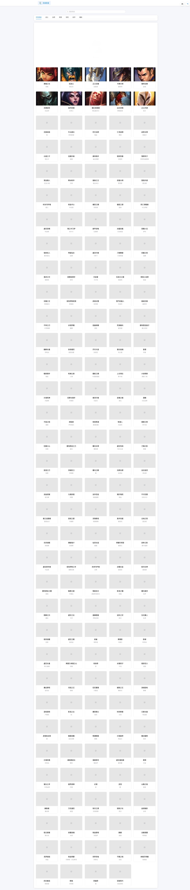
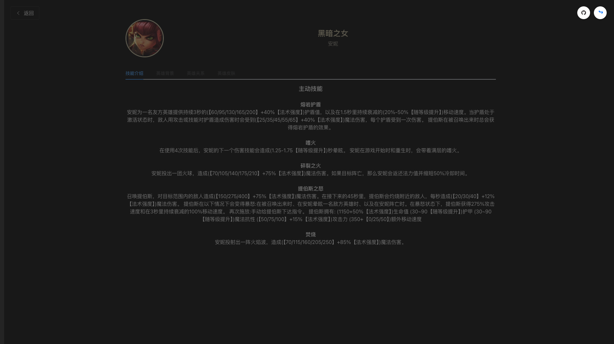
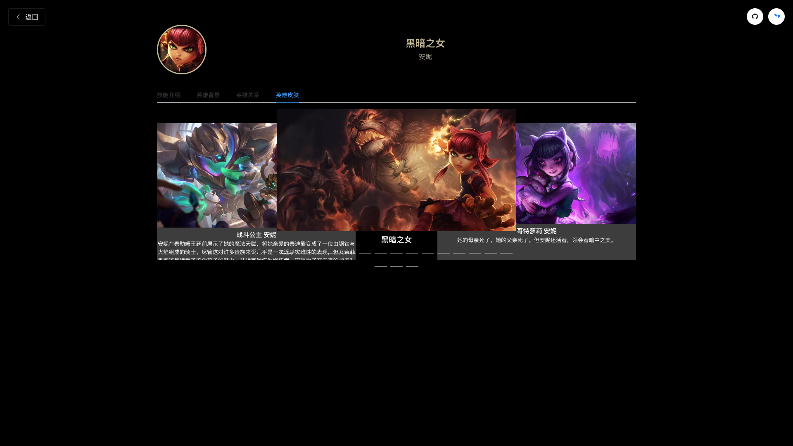

# League of Legends 英雄展示项目

<div align="center">
  
  <p>基于 Vue 3 + Vite 的英雄联盟英雄展示项目</p>
  <p>
    
    
    
    
    
    
  </p>
</div>

## 项目介绍

这是一个使用 Vue 3 + Vite 开发的英雄联盟英雄展示项目，旨在为玩家提供一个现代化、用户友好的英雄信息查询平台。项目采用了最新的前端技术栈，实现了丰富的交互效果和流畅的用户体验。

### 亮点功能

- 实时英雄筛选：支持多维度筛选，包括角色类型、搜索关键词等
- 详细的英雄信息：展示英雄的技能、背景故事、关系网络等
- 精美的皮肤展示：使用轮播图展示英雄皮肤，支持高清预览
- 流畅的动画效果：精心设计的过渡动画，提升用户体验
- 响应式设计：完美适配各种屏幕尺寸

## 技术栈

### 核心框架和工具
| 技术 | 版本 | 说明 |
|------|------|------|
| Vue 3 | 3.5.13 | 渐进式 JavaScript 框架 |
| Vite | 5.0.0 | 下一代前端构建工具 |
| Element Plus | 2.9.1 | 基于 Vue 3 的组件库 |
| Vue Router | 4.2.5 | Vue.js 官方路由管理器 |
| Pinia | 2.1.7 | Vue 状态管理工具 |
| Axios | 1.6.2 | 基于 Promise 的 HTTP 客户端 |

### Vue 3 特性应用
- Composition API
  ```js
  // 使用组合式 API 的示例
  import { ref, onMounted, computed } from 'vue'
  
  export default {
    setup() {
      const heroes = ref([])
      const filteredHeroes = computed(() => 
        heroes.value.filter(hero => /* 过滤逻辑 */)
      )
      
      onMounted(async () => {
        // 获取英雄数据
      })
      
      return { heroes, filteredHeroes }
    }
  }
  ```

- 响应式系统
  ```js
  const state = reactive({
    currentHero: null,
    loading: false,
    error: null
  })
  ```

- 生命周期钩子
  ```js
  onMounted(() => {
    // 组件挂载后执行
  })
  
  onUnmounted(() => {
    // 组件卸载前清理
  })
  ```

### Element Plus 组件使用
- 布局组件
  ```vue
  <el-container>
    <el-header>
      <el-menu mode="horizontal">
        <!-- 导航菜单 -->
      </el-menu>
    </el-header>
    <el-main>
      <!-- 主要内容 -->
    </el-main>
  </el-container>
  ```

- UI 组件
  ```vue
  <el-card>
    <el-image :src="hero.avatar" />
    <el-tag>{{ hero.title }}</el-tag>
    <el-button type="primary">查看详情</el-button>
  </el-card>
  ```

### Vue Router 路由配置
```js
const routes = [
  {
    path: '/',
    component: Heroes,
    meta: { transition: 'fade' }
  },
  {
    path: '/hero/:id',
    component: HeroDetail,
    props: true
  }
]
```

### Axios 网络请求
```js
// API 配置
const api = axios.create({
  baseURL: 'https://game.gtimg.cn/images/lol/act/img/js/',
  timeout: 5000
})

// 请求拦截器
api.interceptors.request.use(config => {
  // 请求前处理
  return config
})

// 响应拦截器
api.interceptors.response.use(response => {
  // 响应数据处理
  return response.data
})
```

### CSS 预处理器和样式
- SCSS
  ```scss
  .hero-card {
    &:hover {
      transform: translateY(-5px);
      box-shadow: 0 4px 12px rgba(0, 0, 0, 0.1);
    }
    
    .hero-name {
      @include text-ellipsis;
      font-weight: bold;
    }
  }
  ```

### 动画效果
- Vue Transition
  ```vue
  <transition name="fade" mode="out-in">
    <router-view></router-view>
  </transition>
  
  <style>
  .fade-enter-active,
  .fade-leave-active {
    transition: opacity 0.3s ease;
  }
  
  .fade-enter-from,
  .fade-leave-to {
    opacity: 0;
  }
  </style>
  ```

### 工具库
- 开发依赖
  ```json
  {
    "devDependencies": {
      "@vitejs/plugin-vue": "^5.0.0",
      "sass": "^1.69.5",
      "vite": "^5.0.0",
      "eslint": "^8.55.0",
      "prettier": "^3.1.1"
    }
  }
  ```

## 项目结构

```bash
src/
├── assets/          # 静态资源
│   ├── styles/      # 全局样式
│   └── images/      # 图片资源
├── components/      # 公共组件
│   ├── GameNav.vue     # 游戏导航组件
│   └── NoData.vue      # 无数据展示组件
├── views/          # 页面组件
│   ├── Heroes.vue      # 英雄列表页
│   └── HeroDetail.vue  # 英雄详情页
├── router/         # 路由配置
├── store/          # 状态管理
├── utils/          # 工具函数
│   ├── request.js     # axios 封装
│   └── constants.js   # 常量定义
├── App.vue         # 根组件
└── main.js         # 入口文件
```

## 功能详解

### 1. 英雄列表页面

- 搜索功能
  - 支持英雄名称搜索
  - 支持英雄称号搜索
  - 实时搜索结果展示

- 分类筛选
  - 战士、法师、刺客、坦克、射手、辅助六大类型
  - 可切换类型查看对应英雄
  - 动态更新英雄列表

- 英雄卡片
  - 展示英雄头像
  - 显示英雄名称和称号
  - 悬浮效果展示更多信息
  - 点击跳转详情页

### 2. 英雄详情页面

- 基础信息
  - 英雄头像和名称
  - 英雄称号
  - 角色定位

- 技能展示
  - 技能图标展示
  - 详细的技能描述
  - 技能效果说明
  - 技能视频预览

- 背景故事
  - 英雄传记
  - 背景故事
  - 相关轶事

- 英雄关系
  - 展示相关英雄
  - 关系网络可视化
  - 点击跳转相关英雄

- 皮肤展示
  - 高清皮肤图片
  - 轮播图展示
  - 皮肤名称和描述
  - 自动播放功能

### 3. 交互设计

- 过渡动画
  - 页面切换动画
  - 组件过渡效果
  - 加载动画

- 响应式布局
  - 适配移动端
  - 适配平板
  - 适配桌面端

## 界面预览

### 英雄列表页


- 展示所有英雄卡片
- 搜索和筛选功能
- 响应式网格布局

### 英雄详情页


- 英雄信息展示
- 技能详解
- 背景故事

### 皮肤展示


- 高清皮肤图片
- 轮播图效果
- 皮肤信息

## 开发环境搭建

### 前置要求

- Node.js >= 16.0.0
- pnpm >= 8.0.0

### 安装步骤

1. 克隆项目
```bash
git clone https://github.com/mhxy13867806343/vue-vite-lol-hreo.git
cd vue-vite-lol-hreo
```

2. 安装依赖
```bash
pnpm install
```

3. 启动开发服务器
```bash
pnpm dev
```

4. 构建生产版本
```bash
pnpm build
```

## 开发规范

### 代码风格

- 使用 ESLint 进行代码检查
- 使用 Prettier 进行代码格式化
- 遵循 Vue 3 组件命名规范

### Git 提交规范

- feat: 新功能
- fix: 修复问题
- docs: 文档修改
- style: 代码格式修改
- refactor: 代码重构
- test: 测试用例修改
- chore: 其他修改

## 贡献指南

1. Fork 本仓库
2. 创建特性分支
3. 提交您的更改
4. 推送到分支
5. 创建 Pull Request

## 许可证

[MIT License](LICENSE)

## 相关链接

- 在线演示
- GitHub 仓库
- 掘金主页
- 问题反馈

## 联系方式

- 作者：mhxy13867806343
- GitHub：[@mhxy13867806343](https://github.com/mhxy13867806343)
- 掘金：[掘金主页](https://juejin.cn/user/1310273588955581)

## 致谢

感谢所有为这个项目做出贡献的开发者！

---

如果您觉得这个项目对您有帮助，欢迎给个 ⭐️ Star ！
